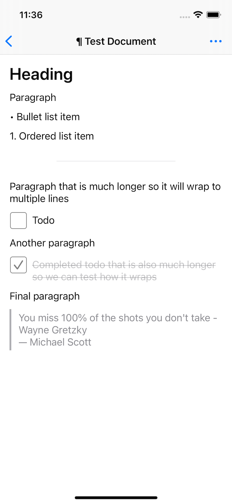

# ¶ Pilcrow

This is an work-in-progress experiment on building a document editor similar to Bear, Notion, Notes.app, Craft, Dropbox Paper, and others. I open-sourced it in case anyone is curious to follow along after my [initial tweets](https://twitter.com/zachwaugh/status/1390325967596527618?s=20). I'm not looking for contributions at this point, since the code is not production ready and I may make substantial changes before 1.0. But would love to hear suggestions for improvement or feature requests, just open an issue.

I have ideas for a few apps I'd like to build around this kind of document, so my main goal is to build the core editor first, and then extract it to a reusable framework to build on top.

### Block type support

- [x] Paragraph/Text
- [x] Heading
- [x] Todo
- [x] Bulleted list item
- [x] Numbered listed item
- [x] Blockquote
- [x] Divider

Punting on these for now since they have ramifications for the document format
- [ ] Image
- [ ] Attachment

## Features

An incomplete and unordered to-do list of features I'm planning on adding support for.

- [x] Toolbar
- [x] Persistence (rebuild on top of UIDocumentBrowserViewController/UIDocument)
- [ ] Inline text formatting (bold, italic, underline, strikethrough, link)
- [ ] Indent/dedent
- [ ] Document consistency (e.g. - moving items should ensure correct numbered items)
- [ ] Improved keyboard navigation
- [ ] Swipe actions on rows
- [x] Drag-and-drop
- [ ] Finish block types
- [ ] Import from Markdown
- [ ] Export to Markdown

## Architecture

The core of the app is a `Document` composed of an array of `Block`s. Each `Block` can have a different content type and renders as its own cell/row in a `UICollectionView` or `UITableView`. See tweet above for discussion of the merits of this approach vs using a `UITextView` based approach. This seemed the most flexible long-term, at the cost of losing some text editing niceties.

The app is based on `UIDocumentBrowserViewController`/`UIDocument` for handling persistence. The document format isn't finalized, so if you play with this you'll most likely lose your data over time. Though the current format is just JSON, so should be fairly simple to recover.

## License

- [MIT](LICENSE)

## Author
- Zach Waugh
- [@zachwaugh](https://twitter.com/zachwaugh)
- [https://zachwaugh.com](https://zachwaugh.com)